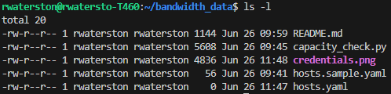
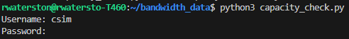

## Setup

# Information about the script
This script is written in Python3 and uses minimal libraries to reach out to specified devices and execute the following commands via RPC calls:
```yaml
show configuration interfaces
show system license
show chassis hardware
show interfaces media detail
```
It uses multithreading to reach out to several devices at a time and will concatenate the results of the show commands into an excel file named 'bandwidth_data.xlsx' for review. 

### Step 1
Copy the project folder onto a server that has access to all devices that will be queried.



### Step 2
Install pre-requisite libraries:
```yaml
python3 -m pip install junos-eznc xlsxwriter
```

### Step 3
Place all hostnames or IP addresses in the 'hosts.yaml' file. A sample file is included as a formatting reference.

### (Optional step depending on device setup)
If a jumphost is required to reach the devices you must configure SSH keys and a config file.

To generate a pair of private/public keys follow the prompts after executing ```ssh-keygen -t rsa```

An example of adding a jumphost config to the existing SSH config is shown below (assuming the jumphost IP is 1.2.3.4):
```yaml
cat <<EOT >> ~/.ssh/config

Host 1.2.3.4
  HostName 1.2.3.4
  IdentityFile ~/.ssh/id_rsa
Host * !1.2.3.4
  ProxyCommand ssh -W %h:%p -q 1.2.3.4
EOT
```

### Step 4
From the same directory where the script was installed you can edit/run the script.

You can change the hosts filename, output filename, and whether or not the RPC commands are logged by modifying the parameters in the Capacity instance as shown below. These are the current defaults:
```python3
... snipped ...
def main():
    capacity = Capacity(hosts_file="hosts.yaml", output_file="bandwidth_data.xlsx", log_rpc=True)
    capacity.get_capacity_usage()
... snipped ...
```
If you are satisfied with the parameters that you have set you can execute the following command to run the script:
```python3
python3 capacity_check.py
```
You will be prompted to enter the username and password that will be used to connect to the devices.
The output file should be created in the same directory you ran the script from.



Wait a few minutes for the results.